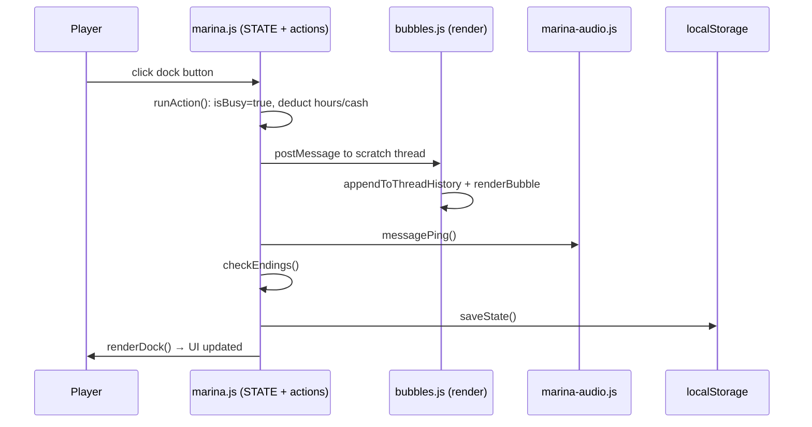
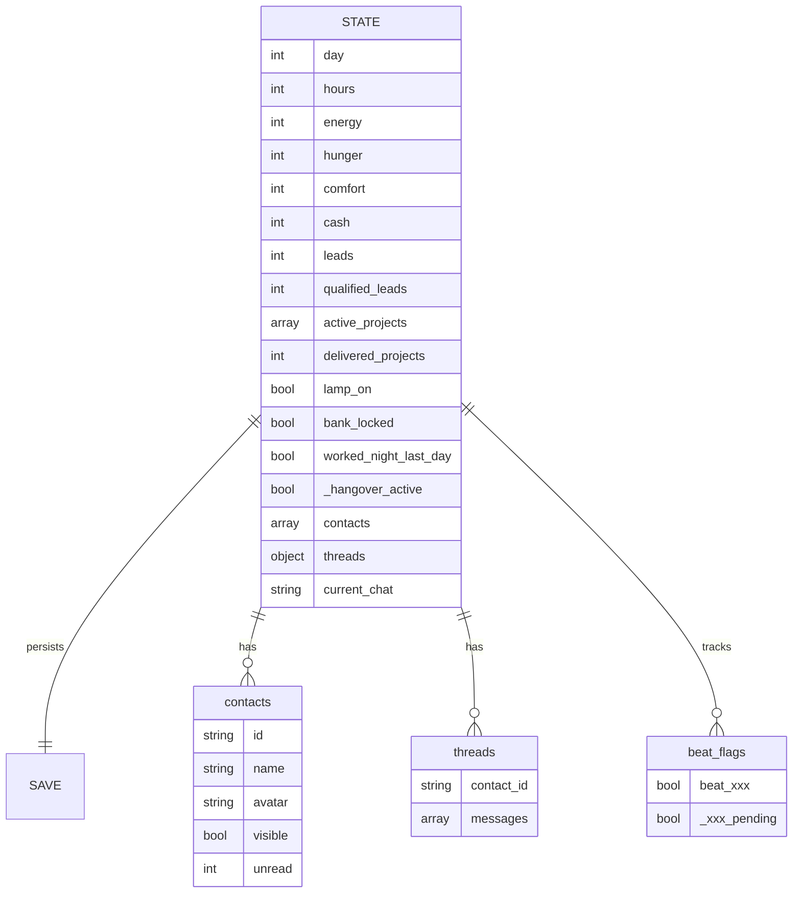
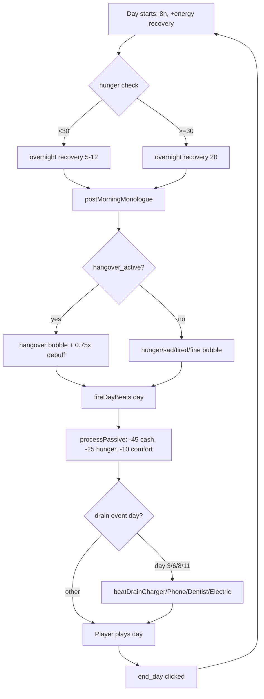
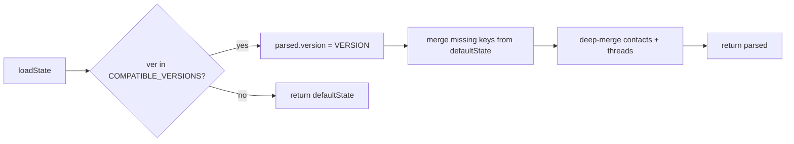
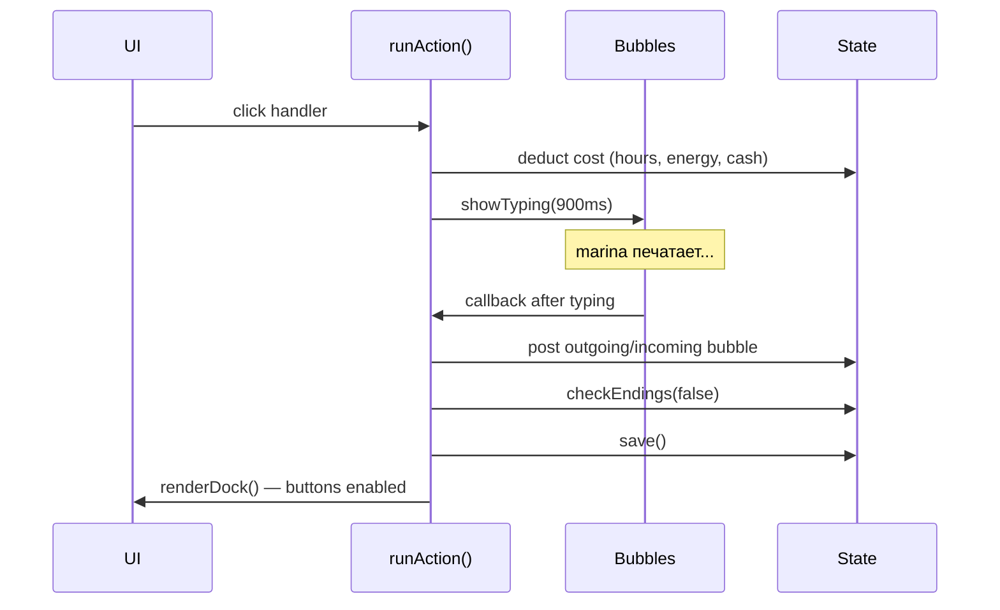

# Architecture

## File structure

```
marina-next/
├── play.html              # Game entry point, all overlays
├── index.html             # Landing page
├── css/marina.css         # 1700 lines — messenger UI, mobile, animations
├── script/
│   ├── marina.js          # 3500 lines — STATE, beats, actions, endings
│   ├── bubbles.js         # 332 lines — chat render, contacts list, chips
│   ├── marina-audio.js    # 350 lines — SFX, soundtrack, finale track
│   └── lead.js            # 200 lines — inline lead form (CTA)
└── img/events/            # 40 webp photos for chat attachments
```

## Module flow



## State shape



## Day cycle



## Save versioning



## Action pipeline


