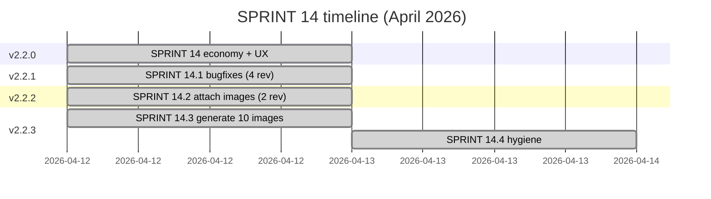

# Changelog

## v2.2.3 — SPRINT 14.4 (2026-04-13) — Hygiene Critical

- Source repo finally pushed to GitHub (was 10+ commits behind deploy mirror)
- Unified all user-facing version strings to v2.2.3 (was 2.1.0/2.1.2/2.1.5 mismatches)
- Brand subtitle now reads VERSION constant dynamically (no more hardcoded drift)
- Wiki initialized with 4 pages + Mermaid diagrams

## v2.2.3 — SPRINT 14.3 (2026-04-12)

- Generated 10 narrative photos via Pollinations.ai FLUX (OpenRouter key revoked)
- charger_broken / phone_cracked / dentist_receipt / electric_bill — drain events
- khozyaika_noise / damage / sweet — arc beats
- hangover_desk / marina_hungry — crisis monologues
- denis_yacht — day 15 (replaces denis_paris)

## v2.2.2 — SPRINT 14.2 (2026-04-12)

- Attached 5 remaining unused images: svetka_phone/drama/taro pool, khozyaika_cat, denis_coffee_spot
- Denis day 6 narrative changed: кино → кофе (matches new photo)
- Fixed text/alt mismatch caught by Codex

## v2.2.1 — SPRINT 14.1 (2026-04-12) — 4 revisions

Bug fixes from Codex audit:
- **rev1:** VERSION sync, beat_denis6 init, _hangover_active init, beatDenis(6) wired, dock routing
- **rev2:** removed dead actHangoutDenis(), added _denis*_pending defaults, restored HANGOUT_DENIS_TEXT usage
- **rev3:** Denis chip enforces bank_locked/cash/hours guards, COMPATIBLE_VERSIONS forward-merge
- **rev4:** stale-closure bypass fix (live STATE check at execute time)

## v2.2.0 — SPRINT 14 (2026-04-12)

Economy rebalance + UX + content (broad sprint):

- **Economy:** 4 drain events ($60/$80/$150/$100, total $390 by day 11)
- Hunger decay 20→25/day, comfort 8→10/day
- Impulse purchase threshold raised (<35, 60% chance)
- Overnight energy recovery hunger-dependent (20→12→5)
- Denis hangouts $250-350 per event (was flat $150)

- **Gameplay:** hunger affects work progress (34→25→15)
- Night work hangover (-10 energy + monologue + 0.75x debuff next day)
- Hungry work text bank (4 variants), hangover morning bank (4 variants)

- **Khozyaika arc:** 4 annoying beats pre-day-12, 3 sweet beats post-day-12

- **UX:** Mobile hide irrelevant disabled buttons (shopping/kirill/denis/night)
- "Turn on computer" CTA on contacts list (was only inside scratch chat)

- **Content:** 13 existing images attached to beats

## v2.1.7 — SPRINT 13 (2026-04-12)

- Removed Tim automation tier 4 (work stays manual)
- Tim automation buttons get 🤖 prefix + green pulse
- Marina POV narrative bubbles for auto-actions (replaces flat system bubbles)

## v2.1.6 — SPRINT 12 (2026-04-12)

Crisis Visibility:
- Persistent top crisis banner (warn/crit pulsing)
- Dynamic brand subtitle reflects worst resource
- Marina morning monologue (5 variants per state)
- Avatar grayscale when comfort < 30

## v2.1.x — earlier sprints

- SPRINT 06: economy + Tim automation + Svetka + sprints 01-05
- SPRINT 07: late-game density beats
- SPRINT 08, 09, 11: mobile rebuild + photos + urgent fixes
- SPRINT 09a: thread rollback + contacts sort
- SPRINT 10: (deferred to backlog)

## v2.0 — initial messenger UI pivot

- Forked from terminal v1.6a to messenger format
- Telegram-inspired bubbles, contacts sidebar, folder tabs
