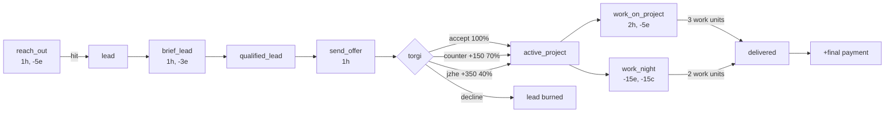
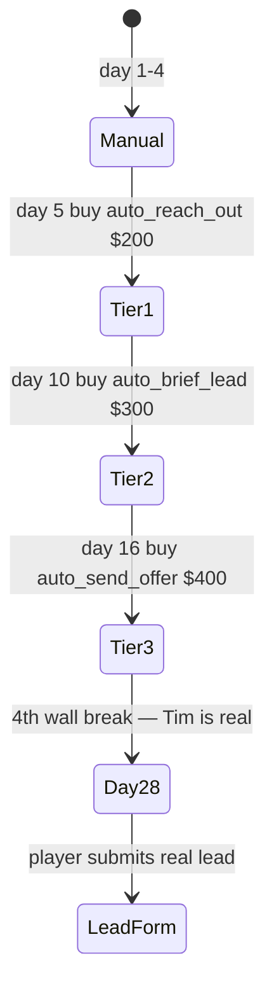
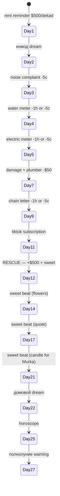
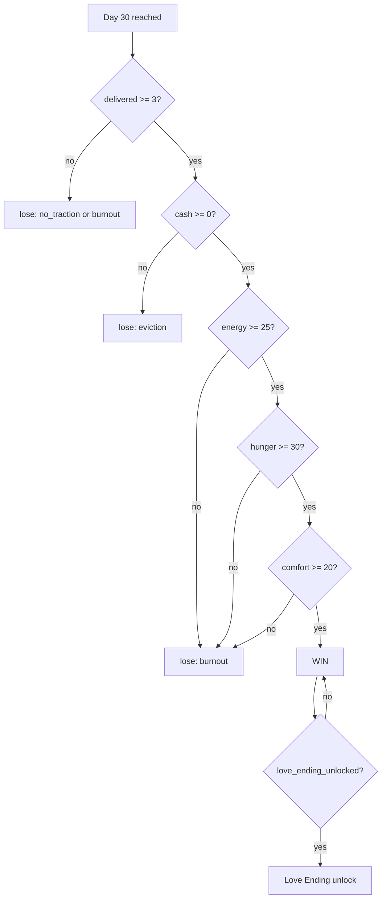

# Features

## Resources

| Resource | Range | Daily decay | Critical |
|---|---|---|---|
| `cash` | -∞..+∞ | -$45 passive + drain events | <-1500 → game over |
| `hours` | 0..8 | reset to 8 each morning | end_day available always |
| `energy` | 0..100 | overnight recovery 5/12/20 | <30 warns, hunger amplifies |
| `hunger` | 0..100 | -25/day | =0 day4+ → starvation lose |
| `comfort` | 0..100 | -10/day | ≤5 day15+ 30% chance burnout |

## Funnel actions

## Tim automation tiers

## Khozyaika arc

## Win/lose conditions

## Characters (24)

**Core (7):** Лена, Анна, Тим, Т-Банк, Наталья (хозяйка), Павел, мама, Денис, Светка, Настя

**Spam recurring (6):** Оля Петрова, Кирилл, БРАТ крипта, Артур, Вера Николаевна, сосед

**Spam one-shot (7):** Людочка, OZON курьер, водитель яндекса, студент СПбГУ, Катя, неизвестный номер, женская сила

**System:** scratch (Marina's notes)

## Crisis UX

When resources critical:
- **Crisis banner** top of screen (yellow warn / red crit pulsing)
- **Brand subtitle** dynamic ("🍔 очень голодна", "⚡ на пределе", "💔 грустит")
- **Avatar grayscale** when comfort < 30
- **HUD pills** color transitions green→yellow→red

## Mobile

- Stack layout: contacts list ↔ chat view (slide transition)
- Disabled non-work buttons hidden (shopping/kirill/denis/night)
- "Turn on computer" CTA on contacts list
- Compact dock max-height 44vh
