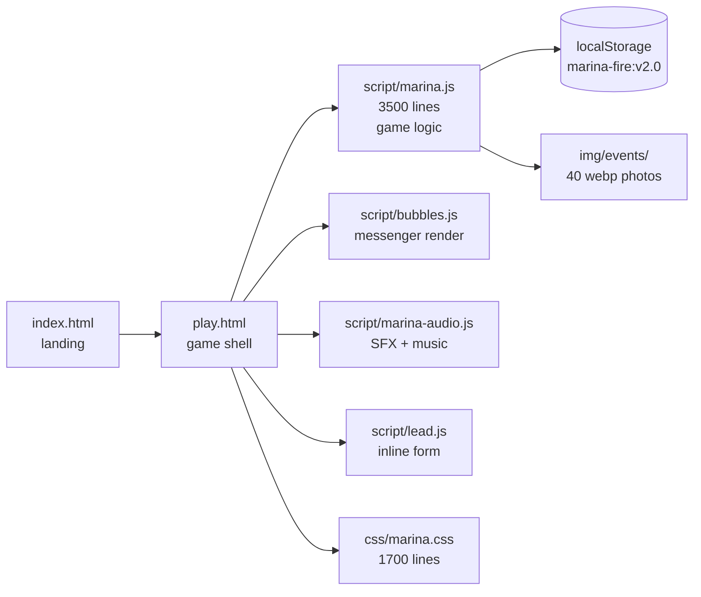
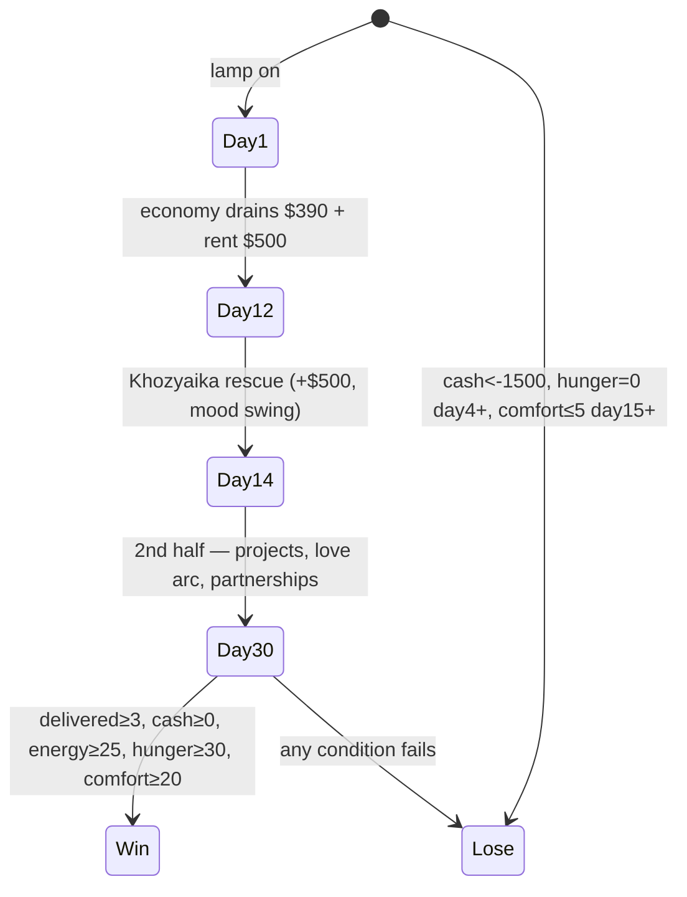

# 🔥 Марина в огне

Survival-мессенджер про 30 дней фаундера. Игрок управляет Мариной — копирайтером, ушедшей из агентства, у неё $500, 12 дней до первой аренды, и три проекта надо закрыть до конца месяца.

**Live:** https://timzinin.com/marina-next/play.html
**Stack:** vanilla JS + jQuery, single-file game logic, telegram-style messenger UI
**Fork:** [doublespeakgames/adarkroom](https://github.com/doublespeakgames/adarkroom) (MPL-2.0)
**Deploy:** GitHub Pages → timzinin.com/marina-next/

## Pages

| Page | What's inside |
|------|---------------|
| [Home](Home) | This page — overview |
| [Architecture](Architecture) | File structure, state, modules |
| [Features](Features) | Mechanics, characters, beats |
| [Changelog](Changelog) | Sprint history, version timeline |

## Quick map

## Status

- **Version:** 2.2.3
- **Last sprint:** SPRINT 14.4 (hygiene)
- **Active arc:** 30-day month, win/lose conditions
- **Characters:** 24 contacts (7 core, 6 recurring, 7 spam, 4 parallel arc)

## Game arc

