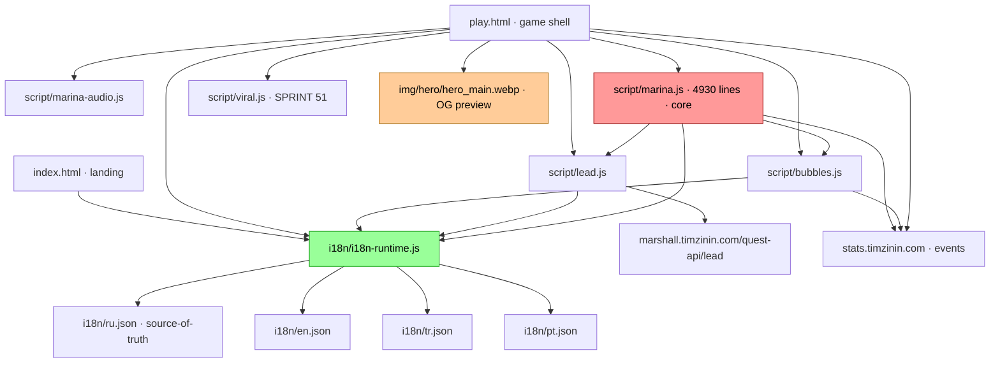
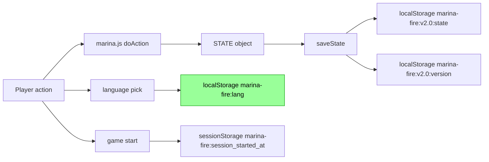

# Architecture

«Marina в огне» — browser-only static SPA. jQuery 1.10.1 + vanilla JS. Deployed via GitHub Pages mirror (`timmyzinin.github.io-tmp` repo).

## File dependencies



## Core directories

```
marina-next/
├── index.html         Landing — hero, features, characters, FAQ
├── play.html          Game shell — overlays, dock, chat UI
├── i18n/              [SPRINT 49] localization layer
│   ├── i18n-runtime.js   t/tArray/tPick/tPlural/init/setLang
│   ├── ru.json           source of truth
│   ├── en.json           Brooklyn NYC adaptation
│   ├── tr.json           Istanbul (Melis) adaptation
│   └── pt.json           São Paulo adaptation
├── script/
│   ├── marina.js         core gameplay (4930 lines, all game logic)
│   ├── bubbles.js        chat/messenger rendering
│   ├── lead.js           lead-form (sends to marshall.timzinin.com)
│   ├── marina-audio.js   Web Audio API sfx + soundtrack playlist
│   └── viral.js          [SPRINT 51] share mechanic
├── css/
│   ├── marina.css        game UI
│   └── landing.css       landing-only styles
└── img/
    ├── hero/             cinematic key arts (1536×1024)
    ├── chars/            character portraits
    ├── events/           per-beat illustrations
    ├── endings/          win/lose finale arts
    └── social/           OG preview variants (1200×630, 1080×1080, 1080×1350)
```

## State persistence



Language preference (`marina-fire:lang`) lives **outside** `STATE` — survives `clearState()`, decoupled from save migration matrix.

## Backend touchpoints

| Service | Purpose | Endpoint |
|---|---|---|
| Lead form | Submit player intake form | `POST https://marshall.timzinin.com/quest-api/lead` |
| Umami | Privacy-first analytics | `https://stats.timzinin.com` (self-hosted, Contabo VPS 30) |

Lead payload (post-SPRINT 49) includes `lang: "ru"|"en"|"tr"|"pt"` so Tim sees which locale generated the lead.

## Deploy

GitHub Pages serves from `https://github.com/TimmyZinin/timmyzinin.github.io-tmp.git` mirror. Source-of-truth dev repo: `TimmyZinin/marina-v-ogne` → `marina-next/` subdirectory rsync-deployed на каждый push.
