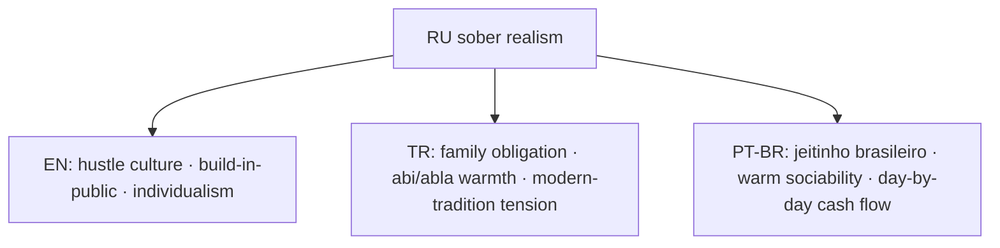
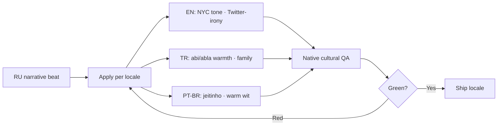

# Cultural Adaptation (D1 = B local substitution)

Локальная подмена per locale. Не просто перевод — характеры, бренды, города, mentality framework адаптируются.

## Mentality framework

| Aspect | RU | EN (NYC) | TR (Istanbul) | PT-BR (São Paulo) |
|---|---|---|---|---|
| Founder culture | "ушла из агентства" | hustle, build-in-public | family says "real job" | jeitinho · creative workaround |
| Money attitude | "хватит на месяц" | optimism + debt normalization | frugality + family safety net | day-by-day · PIX everywhere |
| Crisis response | "позвонить маме" | "swallow pride · call mom for $200" | unconditional but judgmental family | family helps with shame |
| Humor register | dry self-deprecating | Twitter-irony · meme-aware | absurdist + abi/abla warmth | playful · samba-rhythm wit |

## Character substitution table

| Element | RU source | EN (NYC) | TR (Istanbul) | PT-BR (São Paulo) |
|---|---|---|---|---|
| Heroine name | Марина | Marina | **Melis** | Marina |
| Heroine city | Москва | Brooklyn, NYC | Istanbul | São Paulo |
| Bank | Т-Банк | Chase | Garanti | Nubank |
| Bank freeze plot | 115-ФЗ | IRS 1099 contractor freeze | MASAK crypto review | COAF / PIX compliance hold |
| Friend core | Лена | Lucy (Amsterdam) | Zeynep (Ankara) | Camila |
| First client | Анна | Anna | Ayşe | Beatriz |
| Landlady | Наталья Валерьевна | Mrs. Dagmar | Neriman Hanım | Dona Lúcia |
| Ex-bf | Павел | Paul | Kemal | Pedro |
| Mom | мама | Mum | Anne | Mãe |
| Partier friend | Денис | Denis | Deniz | Diego |
| Tinder match | Кирилл | Chris | Kerem | Caio |
| School spam | Оля Петрова (11-Б) | Lily (class of '18) | Elif (Sınıf 11-B) | Letícia (turma '18) |
| Crypto spam | БРАТ крипта | crypto bro | kripto bro | mano cripto |
| Ex-boss | Артур | Arthur | Arda | Arthur |
| Teacher spam | Вера Николаевна | Ms. Brooks | Ayfer Öğretmen | Profª Vera |
| Coworker | Настя | Nadia | Aslı | Natália |
| Delivery courier | OZON | DoorDash | Trendyol | iFood |
| Taxi | Яндекс | Uber | BiTaksi | 99 |
| Ramen slang | доширак | 2am ramen | Çin noodle | miojo |
| Supermarket | Пятёрка | Trader Joe's | BİM | Pão de Açúcar |
| Cosmetics | Рив Гош | Sephora | Gratis | Sephora BR |
| Transit | маршрутка, метро | subway, L train | metrobüs | metrô, ônibus |

**Tim** (Каш, `@timofeyzinin`) — НЕ меняется. Real person at real city, lead-magnet target.

## Beat-by-beat adaptation matrix (~25 narrative beats)

Examples (full table в groovy-petting-creek.md plan file):

| Beat | RU | EN (NYC) | TR | PT-BR |
|---|---|---|---|---|
| Anna offer | $200 upfront $250 final | $300 net-30 invoice, Notion brief | ödeme transferi day 15 | sinal de 50% via PIX, restante via NF |
| Khozyaika rent demand | хозяйка о показаниях счётчиков | Brooklyn super passive-aggressive group text | site yöneticisi WhatsApp grup | zelador no grupo do prédio |
| Pavel loan $300 | бывший просит $300, флиртует ночью | "remember Burning Man? need $250 short term" | "Bodrum'da kaldım, 1500 TL acil" | "lembra Carnaval? preciso R$ 1500" |
| Mama medicine $200 | мама на лекарства | "insurance copay went up, $180" | "ilaçlarım için 1500 TL gerekiyor" | "medicações ficaram caras, R$800" |
| Olya MLM | одноклассница 11-Б, женский клуб | "essential oils opportunity / Mary Kay" | "naturel ürünler, 5000 TL başlangıç" | "Hinode? grupo só mulheres, R$2k" |
| Krypta scam | БРАТ крипта триггерит 115-ФЗ блок | "altcoin pump triggers Chase fraud hold (IRS)" | "kripto abi sahte coin · MASAK incelemesi" | "mano cripto pump · transferência cai em COAF/PIX" |
| Denis hangout | регата, парк горького | rooftop Bushwick / Hamptons / Burning Man | Bodrum yacht / Beşiktaş bar / Adalar | praia em Ubatuba / Vila Madalena |
| Win love ending | 2 года: «Marina AI» $40k MRR · Кирилл CTO | NYC studio · Chris CTO · Brooklyn loft | "Melis AI" · Kerem CTO · Bebek office | estúdio em SP · Caio CTO · Pinheiros |
| Lose burnout | сгорела, в корпорат | "back to 9-to-5 at Stripe" | "corporate'a döndün" | "voltou pra CLT na Nubank" |

## QA process per locale

For each locale (EN/TR/PT-BR), after `/copywriting` first pass:

1. **Native cultural editor checklist**
   - Does heroine's pain resonate as locally lived experience?
   - Brand references current (2025-2026)?
   - Slang/idioms natural to local age group (~28-35 founder)?
   - Humor register correct (US dry-meme / TR absurdist / BR warm-witty)?
   - Family dynamics culturally accurate?
   - Tim as Kaş expat consultant credible in local context?

2. **"Awkward sentence" pass:** read every Marina-outgoing message aloud в local language. If sounds like translation, flag.

3. **Cultural minefield audit:**
   - **EN:** race/class assumptions, IRS jargon accuracy, "founder bro" tone calibration
   - **TR:** religious sensitivity, alcohol references, gender role balance
   - **PT-BR:** regional slang differences (paulistano default), avoid stereotypes

4. **Beat-by-beat fit:** every beat in matrix → green/yellow/red. Red = rewrite.

5. **Smoke playtest by native speaker:** 1-2 native playtesters do full 30-day playthrough, written notes per chapter.
