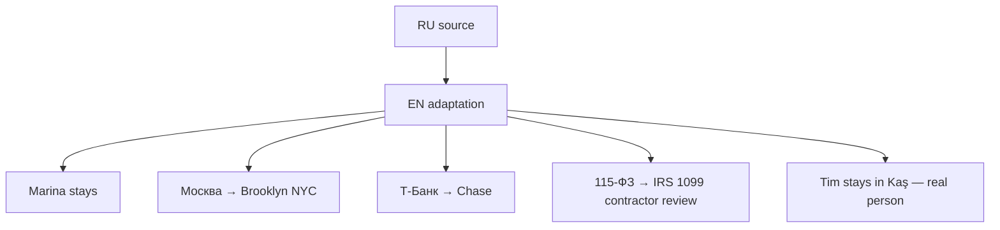

# Locale: EN (English, Brooklyn NYC)

**Heroine:** Marina (Brooklyn founder)
**File:** `i18n/en.json` (757 leaf keys)
**Status:** shipped SPRINT 49 · awaiting Tim QA

## Adaptation overview

## Key character mappings

| RU | EN |
|---|---|
| Марина | **Marina** (Brooklyn) |
| Москва | **Brooklyn, NYC** (Bushwick/Williamsburg) |
| Т-Банк | **Chase** |
| 115-ФЗ | **IRS 1099 contractor freeze** |
| Лена | Lucy (Amsterdam) |
| Анна | Anna |
| Наталья Вал. (хозяйка) | Mrs. Dagmar (Brooklyn super energy) |
| Павел (бывший) | Paul |
| мама | Mum |
| Денис | Denis |
| Кирилл (Tinder) | Chris (Hinge match) |
| Оля Петрова (11-Б) | Lily (class of '18) |
| БРАТ крипта | crypto bro |
| Артур | Arthur |
| Вера Николаевна | Ms. Brooks (retired teacher, Facebook) |
| Настя | Nadia |
| Светка | Lulu |
| OZON | DoorDash |
| Яндекс-такси | Uber |
| СПбГУ | NYU |
| Тим | **Tim (stays — real person in Kaş)** |

## Brands + food substitutions

- доширак → 2am ramen
- гречка → oatmeal (kept "buckwheat" where exotic signal works)
- Пятёрка → Trader Joe's
- Рив Гош → Sephora
- Zara → uniqlo
- парк горького → Prospect Park
- регата → Hamptons sailing trip
- Мойка (Pavel memory) → Gowanus canal (NYC nostalgic)
- slack founders.cc → founders slack
- метро → subway / L train (Brooklyn-specific)

## Cultural adaptation notes

- **Hustle culture** — build-in-public, individualism, LinkedIn humblebrag pressure
- **Money attitude** — optimism + debt normalization (credit cards, student loans)
- **Mom support** — "swallow pride and call mom for $200" via Zelle/Venmo
- **Twitter-irony humor** — meme-aware, self-deprecating
- **IRS 1099 replaces 115-ФЗ** — US tax/AML framing. Rewrite: "account's under review for suspicious activity — Chase flagged a large crypto deposit as unverified income"

## Voice register

**Marina** writes in lowercase, dry Twitter-irony, self-deprecating founder tone:
- "sending cold outreach. 20 addresses. linkedin + email"
- "2am snack: almonds, ramen, tea. hit save 47 times"
- "fine" / "decent" / "🤷"

**Tim** (real person) — warm, wise, sentence-case:
- "read it. thanks for being real."
- "three things for tomorrow morning: 1. triage your inbox..."

**Mum** — soft, slightly worried, uses "sweetie"
**Chris (Kirill)** — DeFi bro surface, emotionally real in love arc
**Mrs. Dagmar** — passive-aggressive Brooklyn super with astrology obsession
**Lulu (Svetka)** — run-on drama voice-notes, ALL CAPS bursts
**crypto bro** — ALL CAPS emoji-spam

## Love ending (2-year epilogue, 8 paragraphs)

Marina's Brooklyn studio "Marina AI" hits $40k MRR, Chris is CTO, Bushwick loft with NYC skyline, Williamsburg café with peonies.

## Lose endings

| Type | Narrative |
|---|---|
| `eviction` | back to parents' Long Island, couch surfing, 1099 nightmare |
| `burnout` | took the L, 6 months later drafting v2 with AI as wingman |
| `no_traction` | empty inbox, trying again |
| `hospital` | ER trip, no-insurance panic, $3500 bill |

## Ambiguous spots (flagged for QA)

1. **`crisis.bank_locked` counter** — EN uses "days" plain. `{daysLeft}` placeholder intact. Day=1 reads "1 days" — consider ICU plurals later.
2. **`contact.teshcha.name`** — "unknown number" / "someone's MIL" kept. MIL (mother-in-law) might read as jargon.
3. **`ending.love.quiet_line`** — RU poetic "это твоя жизнь, ставшая ею по-настоящему" → "this is your life, become the real thing". Alt: "finally the real thing".
4. **`beat.pavel_day5`** — RU "Мойке" (St. Petersburg) → "Gowanus canal". If Paul's pre-NYC backstory canon needed, swap to Lisbon summer.
5. **`beat.svetka.gossip[1]`** — "Oliver selling hookahs" kept. Alt: "smoke shop" / "NFT drops".

## QA checklist (pending Tim QA)

- [ ] Marina's voice native NYC founder, не translated Russian
- [ ] Twitter-irony register consistent
- [ ] Brand references current (2025-2026)
- [ ] IRS 1099 plot beat coherent
- [ ] Brooklyn geography authentic (Bushwick/Williamsburg/Park Slope)
- [ ] Tim's voice credible as Kaş expat consultant addressing US founder
- [ ] Mrs. Dagmar's astrology subplot reads OK in EN
- [ ] Character voices distinct (Marina vs Tim vs Mum vs Chris vs Dagmar vs Lulu)

## Future iterations

- Consider UK EN variant for British market (different slang, £ pricing context)
- SF Bay Area alternative (Austin / SF instead of Brooklyn) — A/B for conversion
- Dated brand audit quarterly (Trader Joe's / DoorDash / Uber still current?)
