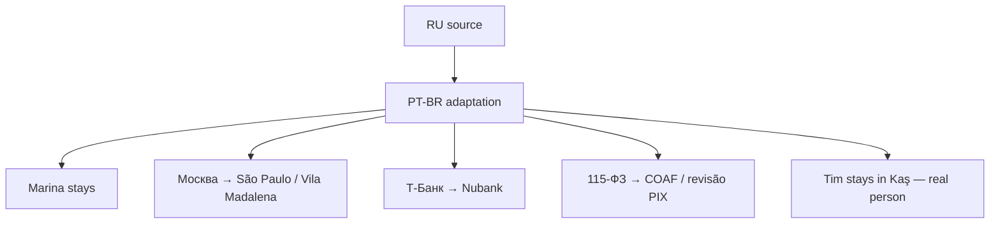

# Locale: PT-BR (Português Brasileiro, São Paulo)

**Heroine:** Marina (Vila Madalena founder)
**File:** `i18n/pt.json` (757 leaf keys)
**Status:** shipped SPRINT 50 · awaiting native QA playtest

## Adaptation overview

## Key character mappings

| RU | PT-BR |
|---|---|
| Марина | **Marina** (nome comum BR) |
| Москва | **São Paulo (Vila Madalena / Pinheiros)** |
| Т-Банк | **Nubank** |
| 115-ФЗ | **COAF / revisão PIX** |
| Лена | Camila (Rio) |
| Анна | Beatriz |
| Наталья Вал. (хозяйка) | Dona Lúcia (senhoria) |
| Павел (бывший) | Pedro |
| мама | Mãe |
| Денис | Diego |
| Кирилл (Tinder) | Caio |
| Оля Петрова (11-Б) | Letícia (turma '18) |
| БРАТ крипта | mano cripto |
| Артур | Arthur |
| Вера Николаевна | Profª Vera |
| Настя | Natália |
| Светка | Sofia |
| OZON | iFood entregador |
| Яндекс-такси | motorista 99 |
| СПбГУ | USP / FGV |
| кот Мурка | gata Mimi |
| Тим | **Tim (stays — real person in Kaş)** |

## Brands + food substitutions

- доширак → miojo
- гречка → arroz com feijão
- яичница → ovos mexidos / tapioca
- пироги (мамины) → bolo de fubá / feijoada
- Пятёрка → Pão de Açúcar (mid-tier) / Dia (discount)
- Рив Гош → Sephora BR
- Zara → Renner (local Brazilian chain)
- парк горького → Parque Ibirapuera
- регата → catamarã em Ilhabela / Angra dos Reis
- шашлык → churrasco
- ужин в ресторане → botequim / restaurante / padaria

## Cultural adaptation notes

- **Jeitinho brasileiro** — creative workaround, warm sociability under pressure
- **Day-by-day cash flow** — PIX instantâneo, boleto vence, FGTS references
- **Mom voice** — WhatsApp audio de 3 minutos, tom caloroso, sem comparações, pede ajuda com amor
- **Group dynamics** — grupo do WhatsApp do prédio (landlady drama), Instagram Stories flex, TikTok brain rot
- **Futbol metaphors** — "não tá dando o nó tático", "vai dar certo", "fé"
- **Carnaval memory** — Pedro's saudade moment (was Burning Man in EN, Bodrum in TR)
- **COAF replaces 115-ФЗ** — Conselho de Controle de Atividades Financeiras + PIX compliance. Rewrite: "sua conta Nubank está em revisão COAF por transferência cripto suspeita"

## Voice register

**Marina** writes in lowercase paulistano, tom descolado, warm-witty self-deprecating founder voice:
- Fillers natural: "cara", "mano", "tipo", "de boas", "tranquilo"
- Gender agreement: "cansada", "orgulhosa", "sozinha" (feminine)
- Regional default: paulistano (avoid carioca "tu", nordestino expressions)

**Mãe** voice: teal, audio WhatsApp, "filha", "vem domingo", "bolo de fubá pronto"
**Dona Lúcia** (senhoria): ezoterical paulistana, tiktok, cartomante, padre conhecido
**Caio** (Tinder): trader cripto, "vamos sair", samba-confidence, "meu corre"

## Love ending (2-year epilogue)

Marina's studio "Marina AI" hits $40k MRR, escritório em Pinheiros, Caio é CTO, peônias trazidas sem motivo, café em Vila Madalena.

## Lose endings

| Type | Narrative |
|---|---|
| `eviction` | pai vem de carro, volta pra BH (Belo Horizonte), mãe feijoada |
| `burnout` | voltou pra CLT na Nubank, 6 meses depois tentando v2 com IA |
| `no_traction` | inbox vazia, recomeço |
| `hospital` | UPA, conta R$2k, SAMU, Dona Lúcia ligou |

## Ambiguous spots (flagged for QA)

1. **rescue.hospital.body** — заменил EN "$3500 bill" на "conta R$2k" (paulistano UPA realistic). USD сохраняется везде кроме этого нарративного upstream. Verify если нужна строгая consistency.
2. **rescue.mama_money.bank_memo** — "mãe mandou pix" (game отображает USD, но "pix" = культурный маркер).
3. **rescue.father.mama_msg** — "vamos pra BH". Если Мариnа из другого города по канону — заменить на "vamos pra casa".
4. **contact.ozon.name** — "iFood entregador" (EN took DoorDash). Альтернативы: Mercado Livre, Shopee если нужны посылки, не food.
5. **spam_oneshot.taxi[2]** — оставил "R$25". EN использует "$5". Привести к USD для consistency.
6. Caio в `krypta` зовётся "mano cripto"; Pedro (ex) — `Pedro`, чтобы различать голоса.

## QA checklist (pending native PT playtest)

- [ ] Marina's voice feels native paulistano founder
- [ ] Jeitinho brasileiro authentic in context
- [ ] Mom's WhatsApp audio culture resonates
- [ ] Nubank/COAF/PIX plot mechanic coherent
- [ ] Family dynamics (Mãe, BH return, Dona Lúcia)
- [ ] Kaş / Tim as expat consultant credible in PT
- [ ] Regional slang default paulistano (avoid carioca/nordestino)
- [ ] Playtest 1-2 Brazilian native speakers (Tim's Twitter/LinkedIn network)

## Future iterations

- Add regional PT variants (carioca, nordestino) if data shows demand
- Consider PT-PT (Portugal) separate locale if European market interest
- Evaluate R$ for all amounts if players confuse USD-in-BR context
