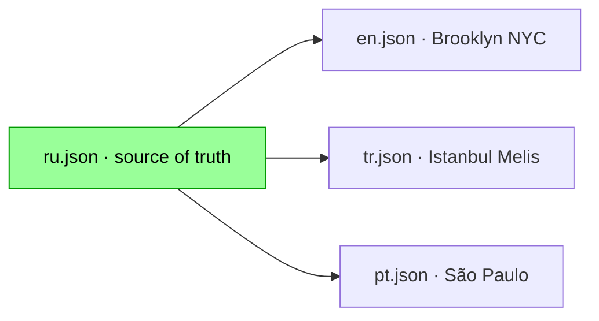

# Locale: RU (Русский, Москва — source of truth)

**Heroine:** Марина (Moscow founder)
**File:** `i18n/ru.json` (757 leaf keys)
**Status:** source of truth · production

## Overview

Russian locale is the **source of truth** for all other locales. Every RU string is the canonical version that other locales translate *from*, with cultural adaptation per locale.



## Key characters (original canon)

| Character | Name | Role |
|---|---|---|
| Heroine | Марина | Agency copywriter, just quit, freelance founder, month-one survival |
| Core friend | Лена | ex-coworker, Moscow, sends client contacts |
| First client | Анна | two-pager project $200 upfront + $250 final, day 15 deadline |
| Consultant | Тим | real person, Kaş, 3-tier AI automation |
| Landlady | Наталья Валерьевна | absurd demands before day 12, forgives rent after |
| Ex-boyfriend | Павел | 4-month silence, asks for $300 loan, late-night nostalgia |
| Mom | мама | always available, medicine money, pies |
| Partier friend | Денис | yacht invites, regatta, Gorky park |
| Tinder match | Кирилл | crypto trader, persistent, love arc option |
| MLM spam | Оля Петрова (11-Б) | school classmate, women's club pyramid |
| Crypto spam | БРАТ крипта | triggers 115-ФЗ bank freeze |
| Ex-boss | Артур | post-exit reconciliation offer |
| Teacher spam | Вера Николаевна | classmates.ru old-teacher reach |
| Coworker | Настя | partnership pitch |
| Bestie | Светка (подружка) | gossip, drama, photo-share |
| One-shot spam | 7 contacts | Людочка / OZON / Яндекс / студент СПбГУ / Катя / свекровь / женская сила |

## Plot anchors (Moscow setting)

- **Т-Банк** (Tinkoff) — bank character, notifications, freeze mechanic
- **115-ФЗ** — Federal Law 115 anti-money-laundering, triggered by Krypta crypto transaction
- **Хозяйка квартиры** — Russian rental culture, utility meter readings, cat-search demands
- **Гречка / доширак / пятёрка / рив гош** — Russian founder bachelor-food lexicon
- **Парк горького / регата / маршрутка** — Moscow specific geography
- **Мама пироги** — domestic Russian mom archetype
- **Кирилл + криптотрейдинг** — stereotypical Russian urban young-man tech entrepreneur

## Voice register

Marina writes in **lowercase Russian, sober realism, dry self-deprecating** founder voice. Anglicisms natural in startup context:
- "рассылаю холодку. 20 адресов. linkedin + email"
- "брифю через sales navigator"
- "ночной дожор: орехи, доширак, чай"
- "норм"

## Namespaces (~760 keys)

| Namespace | Count | Content |
|---|---:|---|
| `lead.*` | 15 | Form labels, button text, error messages |
| `bubble.*` | 20 | Chat UI, folder empty states, funnel labels |
| `contact.<id>.{name,subtitle}` | 48 | 24 characters × 2 fields |
| `text.<bank>[]` | 95 | Random-pick text banks (WORK/REACH_OUT/MORNINGS/AUTO_NARRATIVE etc.) |
| `action.<id>.*` | 50 | Dock action labels, costs, disable reasons |
| `brand.*` | 6 | Version prefix + 5 status states |
| `crisis.*` | 7 | Banner messages with interpolation |
| `system.*` | ~50 | Scratch system messages, callbacks, passives |
| `ui.*` | ~20 | Chrome, folder tabs, dock, footer |
| `overlay.*` | ~25 | Intro/win/lose/rescue/lang overlays |
| `meta.*` | ~15 | SEO tags for play + landing |
| `landing.*` | ~50 | Full landing page copy |
| `beat.*` | ~250 | 55+ narrative beats (anna/lena/tim_creator_fired 4th-wall/khozyaika 11/pavel 9/mama 4/denis 6/olya/krypta/nastya/kirill love arc 10/svetka/spam one-shots/drains) |
| `rescue.*` | ~30 | 4 rescue endings (mama_money/hospital/lena_breakdown/father) |
| `ending.*` | ~25 | Win stats + 8-paragraph love epilogue + 3 lose variants |
| `viral.*` | ~30 | Share card templates, Tim diegetic messages, referral/challenge hero override |

## Migration path

Edits to ru.json are **canonical**. Other locale files should be re-translated when RU changes substantially:

```bash
# Diff ru.json against previous commit
git log -p marina-next/i18n/ru.json | head -100

# If new keys added — propagate to en/tr/pt (can delegate to Claude /copywriting)
# If existing keys changed meaning — flag for re-translation per locale
```

## Game mechanic preserved

- $USD pricing (universal across all 4 locales)
- Day 1/30 structure
- 8 hours/day work
- 3 delivered projects minimum to win
- 115-ФЗ freeze logic (localized framing per locale but plot survives)
- Tim 4th-wall break day 24/28 (identical mechanic, localized Tim voice per locale)
- Love ending (Marina AI studio $40k MRR — localized city/CTO name)

## Wiki sibling pages

- [Locale: EN](Locale-EN.md) — Brooklyn NYC
- [Locale: TR](Locale-TR.md) — Istanbul / Melis
- [Locale: PT](Locale-PT.md) — São Paulo
