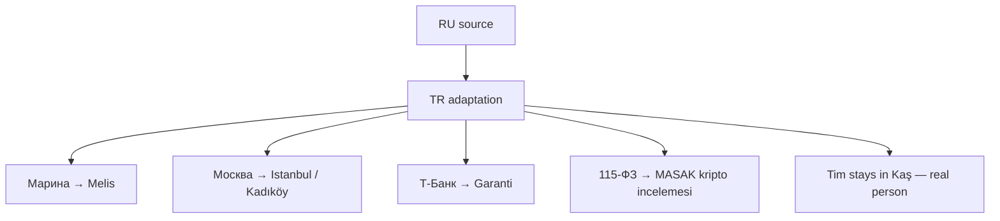

# Locale: TR (Türkçe, Istanbul)

**Heroine:** Melis (Kadıköy kurucu)
**File:** `i18n/tr.json` (757 leaf keys)
**Status:** shipped SPRINT 50 · awaiting native QA playtest

## Adaptation overview

## Key character mappings

| RU | TR |
|---|---|
| Марина | **Melis** |
| Москва | **Istanbul (Kadıköy)** |
| Т-Банк | **Garanti** |
| 115-ФЗ | **MASAK kripto incelemesi** |
| Лена | Zeynep (Ankara) |
| Анна | Ayşe |
| Наталья Вал. (хозяйка) | Neriman Hanım (ev sahibesi) |
| Павел (бывший) | Kemal |
| мама | Anne |
| Денис | Deniz |
| Кирилл (Tinder) | Kerem |
| Оля Петрова (11-Б) | Elif (11-B mezunu) |
| БРАТ крипта | kripto abi |
| Артур | Arda |
| Вера Николаевна | Ayfer Öğretmen |
| Настя | Aslı |
| Светка | Selin |
| OZON | Trendyol |
| Яндекс-такси | BiTaksi |
| СПбГУ | Boğaziçi |
| Тим | **Tim (stays — real person in Kaş)** |

## Brands + food substitutions

- доширак → Çin makarnası / Nongshim
- гречка → bulgur pilavı
- яичница → menemen
- пироги (мамины) → börek / pide
- Пятёрка → BİM
- Рив Гош → Gratis
- Zara → LCW (LC Waikiki)
- пармк горького → Maçka Parkı
- регата → Bodrum yat gezisi
- шашлык → mangal
- ужин в ресторане → meyhane / lokanta

## Cultural adaptation notes

- **Family obligation** — mom tension "when are you getting married" (kısmet ne zaman), modern-traditional clash with founder ambitions
- **Abi/abla warmth** — Turkish big-brother/sister register used for closeness (kripto abi, Ayfer Öğretmen)
- **Honorifics** — Neriman Hanım always uses Hanım suffix for respect
- **Religious sensitivity** — alcohol scenes normalized (Bodrum yacht context with wine OK, but sidestep gratuitous bar framing)
- **MASAK replaces 115-ФЗ** — Turkish Financial Crimes Investigation Board (Mali Suçları Araştırma Kurulu). Rewrite: "Garanti hesabın MASAK nezdinde incelemede — şüpheli kripto transferi"
- **MİT / AFAD** — mom's "safe job" joke uses MİT (intelligence service); "chain letter panic" uses AFAD (emergency agency)
- **Seaside memory** — Pavel/Kemal nostalgic "Beşiktaş sahilde" (seaside walk) replaces Petersburg/Mойка

## Love ending (2-year epilogue)

Melis's studio "Melis AI" hits $40k MRR, office in Bebek (Bosphorus view), Kerem is CTO, Istanbul skyline.

## Lose endings

| Type | Narrative |
|---|---|
| `eviction` | baba geldi (father picks up), Bursa'ya döndün, anne bekler |
| `burnout` | corporate'a döndün (back to corp), 6 ay sonra v2 deniyorsun |
| `no_traction` | inbox boş, tekrar başlamak lazım |
| `hospital` | acil servisi, özel hastane faturası |

## Ambiguous spots (flagged for QA)

1. **Neriman V. abbreviation** — Turkish style uses full names. Kept "V." initial to match source terseness. May feel abrupt to native TR.
2. **Camii mum yaktım** (lit candle at mosque) — slightly non-canonical in Islamic practice; alternative "dua ettim" (prayed). Kept mum/camii for visual parallel with RU church candle.
3. **"20'de 1"** (1 in 20) — numeric ratio for social share. Could be "nadir bir başarı" (rare success) only. Kept numeric for share punch.
4. **USD pricing** — retained throughout per game design. `mama_msg` references TL in one memo but main amounts stay USD.

## QA checklist (pending native TR playtest)

- [ ] Melis's voice feels native Istanbul startup founder, not machine-translated
- [ ] Abi/abla usage authentic in context
- [ ] MASAK plot beat coherent and plausible
- [ ] Family dynamics (Anne, Bursa return) resonate
- [ ] Kaş / Tim as expat consultant credible
- [ ] Religious minefield clean (alcohol, mosque references)
- [ ] Playtest 1-2 Turkish speakers (Tim's Kaş network)

## Future iterations

- Consider "Merve" / "Melek" / "Meryem" as alternative heroine names if Melis doesn't resonate
- Evaluate simpler COAF-style compliance framing if MASAK reads too bureaucratic
