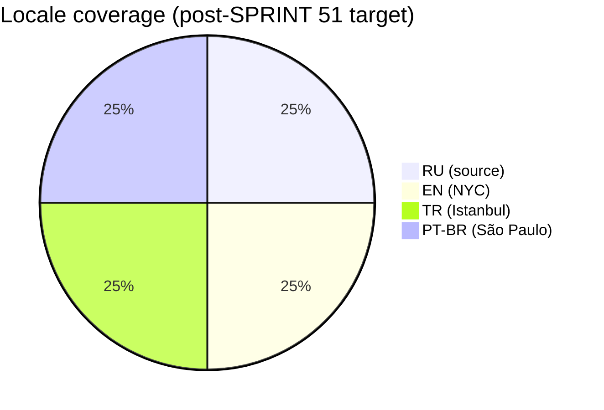

# 🔥 Marina в огне — Wiki

Браузерная narrative survival messenger-sim про первый месяц фаундера. Fork [A Dark Room](https://github.com/doublespeakgames/adarkroom) (MPL-2.0). Lead-magnet для AI-консалтинга Тима Зинина.

**Live:** https://timzinin.com/marina-next/  
**Source:** https://github.com/TimmyZinin/marina-v-ogne  
**Current version:** 2.7.0 (stable) → 2.8.0 (i18n in progress, SPRINT 49)

## Pages

### Architecture & Systems
- [Architecture](Architecture.md) — system overview, file dependencies
- [State Schema](State-Schema.md) — defaultState() fields, save/migration
- [i18n System](i18n-System.md) — runtime, key namespaces, fallback chain
- [Analytics](Analytics.md) — Umami events, SQL dashboard
- [Viral Mechanic](Viral-Mechanic.md) — share surface hierarchy, K-factor model

### Localization
- [Cultural Adaptation](Cultural-Adaptation.md) — beat-by-beat matrix, mentality framework
- [Locale: RU](Locale-RU.md) — Марина · Москва · Т-Банк · 115-ФЗ
- [Locale: EN](Locale-EN.md) — Marina · Brooklyn NYC · Chase · IRS 1099
- [Locale: TR](Locale-TR.md) — Melis · Istanbul · Garanti · MASAK
- [Locale: PT-BR](Locale-PT.md) — Marina · São Paulo · Nubank · COAF/PIX

### Visual & Brand
- [Hero Image](Hero-Image.md) — "This is Fine" rework, Gemini nano-banana pipeline

### Operations
- [Run Book](Run-Book.md) — deploy, OG cache invalidation, regression tests
- [Glossary](Glossary.md) — beat / surface / K-factor / MASAK / etc.

### Sprints
- [Changelog](Changelog.md) — reverse-chronological sprint log
- [Sprint 49](Sprint-49.md) — i18n infra + EN content (in progress)
- Sprint 50 — TR + PT-BR content (planned)
- Sprint 51 — Hero rework + viral mechanic (planned)

## Localization progress

Status as of 2026-04-16:
- ✅ RU — production, stable
- 🔄 EN — SPRINT 49 in progress
- ⏳ TR — SPRINT 50 (queued)
- ⏳ PT-BR — SPRINT 50 (queued)

## Game stats (live, post-launch ~2 days)

- 43 sessions, 75 pageviews, 1291 events
- 20 game starts → 8 day-reached → 1 full win (day 30)
- Top countries: TR 9, US 9, RU 4
- Top surface: lose screen (>30% reach) — primary viral target
