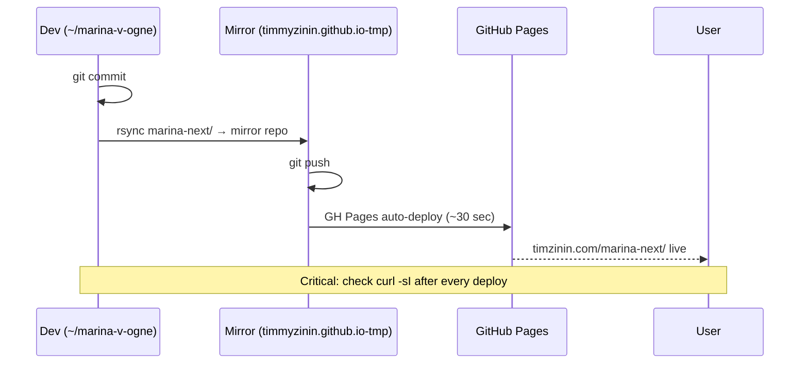

# Run Book

Operational procedures.

## Deploy



### Standard deploy steps

```bash
cd ~/marina-v-ogne

# Stage changes
git add script/ i18n/ play.html index.html css/

# Commit
git commit -m "SPRINT NN: short description"

# Push source
git push origin main

# Mirror to GitHub Pages
rsync -av --delete marina-next/ ../timmyzinin.github.io-tmp/marina-next/
cd ../timmyzinin.github.io-tmp/
git add marina-next/
git commit -m "deploy: SPRINT NN marina-next"
git push origin main

# Wait ~30s for GH Pages build
sleep 35

# Verify
curl -sI https://timzinin.com/marina-next/ | head -3
curl -sI https://timzinin.com/marina-next/play.html | head -3
```

## RU regression test (merge gate)

Before merging any i18n-touching code:

```bash
# 1. Bot playthrough (SPRINT_15_PLAYTEST.md)
# Manual until automated harness rebuilt
# Check: full 30-day RU game completes without errors
# Check: bubble text identical to git HEAD~1

# 2. Pseudo-localization scan
# Open https://timzinin.com/marina-next/play.html?pseudo=1
# Click through full game
# Assert: zero un-wrapped Cyrillic text (means missing extraction)

# 3. Console clean
# Open DevTools → Console → play
# Assert: zero [i18n-miss] warnings

# 4. Save migration
# Set localStorage to pre-i18n save dump
# Reload → game boots in RU default → state intact
```

## Lead backend lang verification

Before SPRINT 49 ship, confirm backend accepts lang field:

```bash
curl -X POST https://marshall.timzinin.com/quest-api/lead \
  -H 'Content-Type: application/json' \
  -H 'Origin: https://timzinin.com' \
  -d '{"name":"check","handle":"@chk123","pain":"i18n","lang":"en","archetype":"marina-v15","session_started_at":'"$(($(date +%s) * 1000 - 60000))"',"source":"marina-v-ogne","website":""}'
# Expect: 200 {"ok":true}
# If 422: backend rejects lang field — fall back to encoding in source: "marina-v-ogne#en"
```

## Umami analytics queries

Connect:
```bash
ssh root@185.202.239.165 'docker exec -it zinin-postgres psql -U umami -d umami'
```

Lang breakdown:
```sql
SELECT DISTINCT ed.string_value AS lang, COUNT(DISTINCT e.session_id) AS sessions
FROM event_data ed
JOIN website_event e ON e.event_id = ed.website_event_id
WHERE e.website_id = 'f739d8de-d6a7-4cc2-a1de-54f733935192'
  AND ed.data_key = 'lang'
GROUP BY 1 ORDER BY 2 DESC;
```

Surface-by-surface K-factor (post-SPRINT 51):
```sql
WITH shares AS (
  SELECT ed.string_value AS surface, COUNT(DISTINCT e.session_id) AS share_count
  FROM website_event e
  JOIN event_data ed ON e.event_id = ed.website_event_id
  WHERE e.website_id = 'f739d8de-d6a7-4cc2-a1de-54f733935192'
    AND e.event_name = 'share_platform_clicked'
    AND ed.data_key = 'surface'
  GROUP BY 1
),
referrals AS (
  SELECT COUNT(DISTINCT e.session_id) AS ref_count
  FROM website_event e
  WHERE e.website_id = 'f739d8de-d6a7-4cc2-a1de-54f733935192'
    AND e.event_name = 'referral_game_started'
)
SELECT s.surface, s.share_count, r.ref_count,
       ROUND(r.ref_count::numeric / NULLIF(s.share_count, 0), 3) AS k_factor
FROM shares s, referrals r;
```

## OG cache invalidation (after hero image swap, SPRINT 51)

After replacing `hero_main.webp`, social platforms cache OG previews. Force re-fetch:

### Telegram
```
1. Open chat with @WebpageBot in Telegram
2. Send: https://timzinin.com/marina-next/
3. Bot replies with new preview, confirms cache invalidated
4. Test: paste link in DM → new image displayed
```

### LinkedIn
```
1. Visit https://www.linkedin.com/post-inspector/
2. Paste: https://timzinin.com/marina-next/
3. Click "Inspect" → fetches fresh, invalidates LinkedIn cache
4. Test: create draft post with link → new image displayed
```

### Twitter / X
```
1. Visit https://cards-dev.twitter.com/validator (deprecated but still works for Card cache)
2. Paste URL · click "Preview card"
3. If old image cached, force purge:
   curl -X POST "https://cards-dev.twitter.com/preview" -d "url=https://timzinin.com/marina-next/"
4. Test: tweet draft → new card image
```

## SSH Contabo VPS 30 (analytics + lead backend)

```
Host: 185.202.239.165
Auth: ssh root@185.202.239.165 (pubkey only, fail2ban active)
RULE: одна SSH-сессия за раз. Команды через && в одном вызове.
```

Common ops:
```bash
# View Umami DB
ssh root@185.202.239.165 'docker ps | grep umami && docker exec -it zinin-postgres psql -U umami -d umami'

# Check lead backend health
ssh root@185.202.239.165 'docker logs marshall-api --tail 50'

# Restart Umami if needed
ssh root@185.202.239.165 'docker restart umami'
```

## Wiki updates

After every commit:
```bash
cd ~/marina-v-ogne
git clone https://github.com/TimmyZinin/marina-v-ogne.wiki.git .wiki  # first time
cd .wiki && git pull  # subsequent

# Copy from docs/wiki-pages/ (source of truth in main repo)
cp ../docs/wiki-pages/*.md .

# Commit + push
git add . && git commit -m "docs: SPRINT NN — what changed" && git push
```

**BLOCKER:** Wiki repo doesn't exist until Тим creates first page via UI:
1. Visit https://github.com/TimmyZinin/marina-v-ogne/wiki
2. Click "Create the first page"
3. Save → wiki repo becomes accessible
