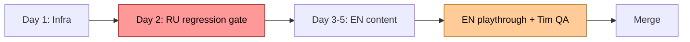

# Sprint 49 — i18n Infrastructure + EN Content

**Status:** 🔄 IN PROGRESS  
**Started:** 2026-04-16  
**Estimated:** 4-5 days  
**Goal:** Build i18n infrastructure + English content with cultural adaptation (NYC/Brooklyn founder context)

## Scope



## Day 1 — Infrastructure (DONE this session)

- [x] **i18n-runtime.js** — `MarinaI18n.{t,tArray,tPick,tPlural,init,setLang,detectSystem,getLang}` API
- [x] **ru.json** — source of truth, **545 lines, 409 leaf keys**: `lead.*`, `bubble.*`, `contact.*`, `text.*`, `action.*`, `brand.*`, `crisis.*`, `system.*`, `ui.*`, `overlay.*`, `meta.*`, `landing.*`
- [x] **lead.js** — Cyrillic literals → `t()` calls; `lang` field added to payload
- [x] **bubbles.js** — chat headers, empty states, funnel labels, contact name lookup → i18n
- [x] **marina-audio.js** — no user-facing strings (only comments, skipped)
- [x] **Backend pre-check** — `marshall.timzinin.com/quest-api/lead` accepts `lang` field (200 OK)
- [x] **marina.js partial refactor:**
  - [x] tStr() / tPickOr() / currentLang() helpers added near pick() at :550
  - [x] track() wrapper auto-injects `lang` into all Umami events
  - [x] All 19 `pick(TEXT_BANK)` callsites → `tPickOr('text.bank', TEXT_BANK)` with RU fallback
  - [x] renderDock — all 12 action labels + costs + disable reasons via tStr() with RU fallback
  - [x] renderBrandStatus — version prefix + 5 status states via tStr()
  - [x] renderCrisisBanner — 7 banner messages via tStr() with `{daysLeft}` `{absCash}` interpolation
  - [x] postMorningMonologue hangover system note
- [x] **play.html** — data-i18n attributes on overlays (intro/win/lose/rescue), folder tabs, brand, footer, dock, chat, lang-overlay
- [x] **play.html** — lang-overlay markup (4 buttons) + footer 🌐 lang switcher + bootstrap script
- [x] **index.html** — full data-i18n coverage: nav, hero, gallery, about, features, characters, FAQ, footer
- [x] **index.html** — language `<select>` switcher in nav + auto-detect head script (avoids FOUC)
- [x] **APP_VERSION → 2.8.0-i18n-wip** + all `?v=2.8.0` query strings updated
- [ ] **marina.js beat-functions** — ⏳ NOT STARTED (~600 dialogue strings in 68 beats, lines 2557-3530) — biggest remaining work
- [ ] **marina.js endings** — ⏳ NOT STARTED (win/lose/love narratives, ~50 strings, lines 4317-4470)
- [ ] **marina.js inline system/notify/project strings** — ⏳ partial

## Day 2 — RU regression gate (BLOCKING merge)

- [ ] Bot playthrough via SPRINT_15_PLAYTEST.md harness — full 30-day RU run
- [ ] Pixel-identical bubble text vs git HEAD~1 (assert no regression)
- [ ] Pseudo-localization: `?pseudo=1` wraps keys as `key` → zero un-wrapped Cyrillic
- [ ] Console — zero `[i18n-miss]` warnings
- [ ] `/codex-review` APPROVED

## Day 3-5 — EN content + cultural adaptation

- [ ] `i18n/en.json` first pass via Claude `/copywriting` skill
- [ ] Apply beat-by-beat adaptation matrix (~25 key beats rewritten для NYC/Brooklyn founder context)
- [ ] 115-ФЗ → IRS 1099 contractor freeze rewrite (plot survives)
- [ ] Mentality framework: hustle culture, Twitter-irony, individualism
- [ ] Тим cultural QA pass — beat-by-beat green/yellow/red review
- [ ] Awkward-sentence pass — every Marina-outgoing line read aloud
- [ ] Landing `<select>` lang switcher RU↔EN

## Files modified

| File | Lines | Change |
|---|---:|---|
| `script/marina.js` | 4930 | refactor (heaviest) |
| `script/bubbles.js` | 364 → 388 | i18n shim + contact name lookup |
| `script/lead.js` | 203 → 218 | i18n shim + lang in payload |
| `script/marina-audio.js` | 349 | no user strings (skipped) |
| `play.html` | 190 | data-i18n attrs + lang overlay (TODO) |
| `index.html` | 181 | auto-detect head script + switcher (TODO) |
| `i18n/i18n-runtime.js` | NEW 220 lines | runtime API |
| `i18n/ru.json` | NEW ~250 keys | source of truth |
| `i18n/en.json` | NEW (TODO) | EN content |

## Risks

| Risk | Severity | Status |
|---|---|---|
| RU regression from t() refactor | HIGH | Bot playthrough merge gate, codex-review required |
| Backend rejects `lang` field | MED | ✅ Verified accepts (200 OK with lang field) |
| Cultural sub feels artificial | MED | Тим QA gate перед merge |
| 115-ФЗ plot loss in EN | MED | Rewrite beat as IRS 1099 freeze |

## Cultural decisions (D1 = B local substitution)

- **Heroine:** Marina (NYC, Brooklyn) — name preserved, location relocated
- **Bank:** Т-Банк → Chase
- **Bank freeze:** 115-ФЗ → IRS 1099 contractor suspicious activity hold
- **Friend:** Лена → Lucy (Amsterdam)
- **First client:** Анна → Anna
- **Ex-bf:** Павел → Paul
- **Mom:** мама → Mum
- **Tinder:** Кирилл → Chris
- **Crypto bro:** БРАТ крипта → crypto bro

Tim stays Tim, in Kaş (real person, real place).

## Verification commands

```bash
# Backend lang accept check (re-run before ship)
curl -X POST https://marshall.timzinin.com/quest-api/lead \
  -H 'Content-Type: application/json' \
  -H 'Origin: https://timzinin.com' \
  -d '{"name":"check","handle":"@chk123","pain":"i18n","lang":"en","archetype":"marina-v15","session_started_at":1234567890,"source":"marina-v-ogne","website":""}'
# Expect: 200 {"ok":true}

# Umami: lang attribute in events (post-deploy)
ssh root@185.202.239.165 'docker exec zinin-postgres psql -U umami -d umami -c "SELECT DISTINCT ed.string_value, COUNT(DISTINCT e.session_id) FROM event_data ed JOIN website_event e ON e.event_id=ed.website_event_id WHERE e.website_id='"'"'f739d8de-d6a7-4cc2-a1de-54f733935192'"'"' AND ed.data_key='"'"'lang'"'"' GROUP BY 1 ORDER BY 2 DESC;"'

# Live URL check (post-deploy)
curl -sI https://timzinin.com/marina-next/?lang=en | head -3
playwright-cli open "https://timzinin.com/marina-next/?lang=en"
```
