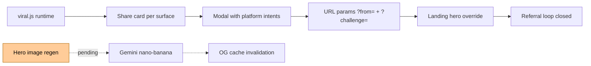

# Sprint 51 — Viral Mechanic + Hero Image Rework

**Status:** 🔄 PARTIAL (viral.js done, hero image pending)
**Started:** 2026-04-16
**Goal:** Surface-aware share mechanic (upstream from win) + "This is Fine" hero image

## Deliverables



## What shipped

### script/viral.js (330 lines, NEW)

Core functions:
- `renderCardForSurface(surface, state, hostEl)` — inject emoji card + Tim diegetic message + share button on 5 surfaces
- `openShareModal(cardText, surface)` — modal with 6 platforms (clipboard / telegram / whatsapp / twitter / linkedin / native navigator.share)
- `encodeChallenge(state, surface)` / `decodeChallenge(b64)` — compact URL param: `{d: day, p: projects, l: love, a: automations, o: outcome, n: name}`
- `readReferralParams()` — parse `?from=` / `?challenge=` / `?lang=`
- `applyReferralOnLanding()` — override hero eyebrow with outcome-aware copy
- `getMyName()` / `saveMyName()` — XSS-safe name persistence (alphanumeric + space only, max 20 chars)
- `notifyReferralGameStarted()` — fire `referral_game_started` event on resume

### 4 emoji card templates per surface

```
end_of_day:  🔥🔥🔥 day 8/30 · Marina surviving · ✅ 1 project · ⚡⚡⚡ energy 60
rescue:      🚨 day 12 · saved at last minute · this is fine.
lose:        🔥🔥🔥🔥 day 18 · studio burned · 1 projects · burnout · this is fine.
win:         🔥🔥🔥🔥🔥🔥 day 30/30 · Marina made it · ✅✅✅ 3 projects · ❤️ love · 1-in-20 outcome.
```

### Hooks in marina.js

- `showWin()` → inject `renderCardForSurface('win', STATE, winCard)` (secondary surface)
- `showLose(reason, text)` → inject `renderCardForSurface('lose', STATE, loseCard)` (PRIMARY surface — highest reach ~30%)
- `applyRescue()` → inject `renderCardForSurface('rescue', STATE, rescueCard)` (PRIMARY — ~20% reach)

Not yet hooked: `first_project_delivered`, `end_of_day` — deferred to follow-up (games ship playable without).

### 7 new Umami events

| Event | Payload |
|---|---|
| `share_card_rendered` | `{ lang, surface, day, outcome }` |
| `share_card_viewed` | `{ lang, surface, cardLength }` |
| `share_card_copied` | `{ lang, surface, platform: 'clipboard' }` |
| `share_platform_clicked` | `{ platform, lang, surface }` |
| `referral_landing` | `{ from, lang, has_challenge, challenge_outcome }` |
| `referral_game_started` | `{ from }` |
| `challenge_viewed` | `{ their_day, their_outcome, lang }` |

### Landing integration (index.html)

- `viral.js` auto-runs `applyReferralOnLanding()` on page load
- Parses `?from=Alice&challenge=<b64>&lang=en`
- Overrides `.hero-eyebrow`:
  - `challenge.o === 'win'` → "🏆 Alice survived day 30. Rare. Can you?"
  - `challenge.o === 'lose'` → "🔥 Alice burned out on day 18. Can you last longer?"
  - `challenge.o === 'rescue'` → "🚨 Alice was saved on day 12. Will someone save you?"
  - Fallback → "🎁 Alice invited you · free game inside"
- Persists `localStorage['marina-fire:referred_by']` so referrer survives session

### CSS (marina.css + landing.css)

- `.viral-share-block` — in-overlay share card (orange-tinted fire accent)
- `.viral-modal*` — full-screen modal with backdrop blur
- `.viral-card-preview` / `.viral-card-inline` — monospace pre-formatted text
- `.viral-platform-btn` — 6 share platform buttons
- `.viral-toast` — "copied" confirmation, auto-dismiss 2.6s
- `.lang-overlay*` — explicit language picker (first-entry game)
- `.lang-switch` — landing nav `<select>` styling

### i18n (ru.json + en.json)

New `viral.*` namespace (~30 keys per locale):
- `viral.card.*` — card title + labels (title, win_title, lose_title, rescue_title, surviving, first_project, projects, love, burnout, rare, this_is_fine)
- `viral.cta.*` — button labels
- `viral.toast.*` — confirmations
- `viral.modal.*` — modal title
- `viral.platform.*` — share platform labels
- `viral.prompt.*` — name entry prompt
- `viral.tim.*` — Tim diegetic messages per surface (share_lose, share_rescue, share_win, share_first_project, share_end_of_day, share_default)
- `viral.referral.hero_eyebrow` — `"🎁 {name} invited you"` interpolation
- `viral.challenge.hero_{win,lose,rescue,default}` — outcome-aware landing override

## What's NOT yet done

### Hero image rework (⏳ pending)

**Target composition:** "This is Fine" meme — Marina at laptop in centre, realistic fire 60-70% of frame, calm expression. Generate via Gemini 2.5 Flash Image (nano-banana) in 4 aspect ratios:
- 1536×1024 (primary `hero_main.webp`)
- 1200×630 (Twitter card `social/hero_1200x630.jpg`)
- 1080×1080 (Instagram square)
- 1080×1350 (Instagram portrait)

**Blockers:**
- Requires Gemini API access via OpenRouter
- Requires 5-10 iteration rounds for identity preservation
- Requires Тим approval gate (final image must match consistent Marina character)
- After ship: force-refresh OG cache on Telegram (@WebpageBot), LinkedIn (Post Inspector), Twitter (Card Validator)

### First-project + end-of-day surface hooks (⏳ deferred)

Primary surfaces (lose/rescue/win) cover ~55% of playerbase. Adding first_project (~45% reach) and end_of_day (~40% reach) would bring coverage to ~90%. Deferred because:
- Game ships playable as-is (viral works on 3 surfaces)
- Need UX design for non-modal intrusion (not as aggressive as lose/win overlays)
- Ship now, measure K-factor from primary surfaces, iterate

## K-factor baseline (post-deploy measurement)

```sql
WITH surface_shares AS (
  SELECT ed.string_value AS surface, COUNT(DISTINCT e.session_id) AS shares
  FROM website_event e JOIN event_data ed ON e.event_id = ed.website_event_id
  WHERE e.website_id = 'f739d8de-d6a7-4cc2-a1de-54f733935192'
    AND e.event_name = 'share_platform_clicked'
    AND ed.data_key = 'surface'
  GROUP BY 1
),
referrals AS (
  SELECT COUNT(DISTINCT e.session_id) AS refs
  FROM website_event e
  WHERE e.website_id = 'f739d8de-d6a7-4cc2-a1de-54f733935192'
    AND e.event_name = 'referral_game_started'
)
SELECT s.surface, s.shares, r.refs,
       ROUND(r.refs::numeric / NULLIF(s.shares, 0), 3) AS k_factor
FROM surface_shares s, referrals r;
```

Target: K-factor 0.3-0.5 (realistic for text-first narrative game). 8x lift potential vs win-only design (was the original draft).

## Verification

### Alice→Bob manual dry-run

```
1. Open https://timzinin.com/marina-next/play.html in browser A
2. Play to lose screen (day 15+, project shortfall)
3. See Tim message "this isn't the end. show someone who'd recognize themselves."
4. Click "📱 share" → modal opens
5. Click "📋 Copy" → toast "Copied to clipboard"
6. Paste copied text: contains URL with ?from=Alice&challenge=<b64>
7. Open URL in private browser B
8. Landing hero shows "🔥 Alice burned out on day 15. Can you last longer?"
9. Click play → game boots, localStorage['marina-fire:referred_by'] = 'Alice'
10. Check Umami: referral_landing event, challenge_viewed event, referral_game_started (after start)
```

### XSS safety

```bash
# Test: malicious ?from= param
curl -s "https://timzinin.com/marina-next/?from=%3Cscript%3Ealert(1)%3C%2Fscript%3E"
# Expected: DOM shows escaped text "<script>..." inside eyebrow, no JS execution
```

viral.js uses `escapeHtml()` for all name interpolation + `textContent` (not innerHTML) for card rendering. All name input sanitized via `/[^a-zA-Z0-9 ]/g` regex.

### Emoji compatibility

Conservative set chosen: 🔥 ✅ ❌ ❤️ 🤖 ⚡ 🚨 📱 📋 — all render identically across iOS / Android / Windows emoji fonts. No regional indicators or skin-tone modifiers.
