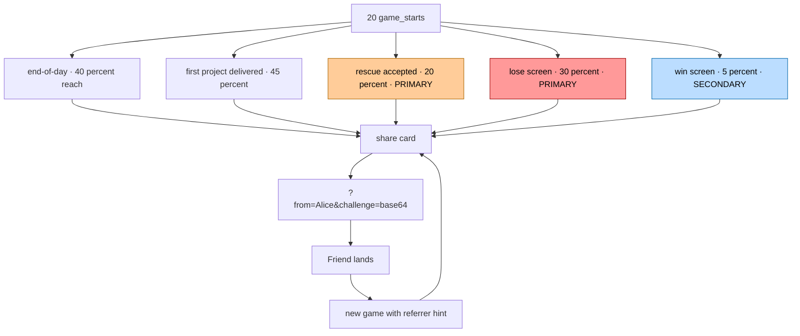

# Viral Mechanic (SPRINT 51)

Самовоспроизводящийся share loop. Surface = lose/rescue (primary), не win (funnel-gated).

## Core insight: completion funnel ≠ viral funnel

В метриках 20 game_starts → 8 day_reached → 1 win. Share button **только на win** = ceiling 5% от стартов. Виральная петля не запустится.

**Fix:** Move share UPSTREAM to surfaces где >40% игроков proходят:



## The loop — Alice → Bob

1. Alice plays. Day 12 — hunger drops, hospital rescue offered. Accepts. Card auto-generates с её stats.
2. Tim 4th-wall message: "это не конец. покажи кому-то кто похож на тебя."
3. Alice copies URL: `timzinin.com/marina-next/?from=Alice&challenge=eyJkIjoxMiwib3V0Y29tZSI6InJlc2N1ZSJ9&lang=en`
4. Friend opens → landing hero override: "🚨 Alice was saved by ER on day 12. Will you?"
5. Friend plays → game stores `referred_by=Alice`. Day 5 friend hits own crisis → share moment again.
6. Loop ripples through lose/rescue moments — independent of win conversion.

## V1 mechanics

**M1. Emoji grid + copy-to-clipboard** — 4 templates per surface

```
🔥🔥🔥 day 8/30 · Marina survives        (end_of_day)
🚨 day 12 · saved by mum                  (rescue)
🔥🔥🔥🔥 day 18 · Marina's studio burned  (lose)
🔥🔥🔥🔥🔥🔥 day 30/30 — Marina made it    (win)
```

**M2. Referral link `?from=<name>`**
- Prompt once: "What should we call you in the link?"
- Sanitize: `replace(/[^a-zA-Z0-9 ]/g,'').slice(0,20)`
- localStorage persist · skips prompt next share
- Landing hero override: "🎁 {name} invited you · free game inside"

**M3. Challenge link `?challenge=<base64>`**
- Encodes `{d, outcome, p, l, a, n}` (day/outcome/projects/love/automations/name)
- Outcome-aware landing copy: loss_burnout / loss_eviction / rescue / win

## Tim 4th-wall integration (diegetic share)

Share triggers via Tim's in-game messages — feels native, not marketing overlay:
- **Lose:** "Марина, это не конец. покажи это кому-то кто узнает себя."
- **Rescue:** "ты держишься. покажи кому-то одному."
- **Win:** "ты прошла. редкий случай. покажи."

Reply chip "📱 поделиться" → opens share modal с outcome-aware emoji card.

## Share platform integration

Priority order:
1. `navigator.share` API (mobile native sheet)
2. Platform intents (desktop):
   - Telegram: `t.me/share/url?url=X&text=Y`
   - WhatsApp: `wa.me/?text=X`
   - Twitter: `twitter.com/intent/tweet?text=X`
   - LinkedIn: `linkedin.com/sharing/share-offsite/?url=X`
   - Copy: `navigator.clipboard.writeText()`

## Analytics events (new — surface-aware)

| Event | Payload |
|---|---|
| `share_card_viewed` | `{ lang, day, surface, outcome, love, projects }` |
| `share_card_copied` | `{ lang, surface, platform: 'clipboard' }` |
| `share_platform_clicked` | `{ platform, lang, surface, outcome }` |
| `referral_landing` | `{ from, lang, has_challenge, challenge_outcome }` |
| `referral_game_started` | `{ from }` |
| `challenge_viewed` | `{ lang, their_day, their_outcome }` |

**Surface-by-surface K-factor:** `referral_game_started filtered by surface / share_platform_clicked filtered by surface`. Identifies winning surface для optimization.

## K-factor model

K = referrals per share × share rate per surface × surface reach

Realistic estimate:
- K-factor target: 0.3-0.5 (text-first narrative game)
- K=0.5 → game удваивается от любого seed с decay
- K=1.0 → true viral exponential growth

Compared to win-only: 8x potential lift через upstream surfaces.
