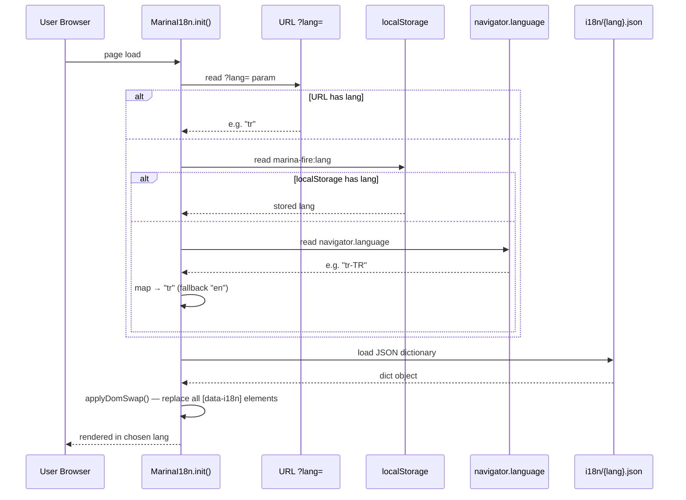

# i18n System

Локализация на 4 языка (RU/EN/TR/PT-BR) через JSON-файлы + runtime t() функцию. Зашипано в SPRINT 49.

## Resolution priority



## Runtime API

`window.MarinaI18n` exposes:

| Method | Purpose | Example |
|---|---|---|
| `t(key, vars)` | Resolve string by dotted key with `{var}` interpolation | `t('crisis.bank_locked', {daysLeft: 3})` |
| `tArray(key)` | Get array (for random-pick text banks) | `tArray('text.work')` |
| `tPick(key)` | Random item from array | `tPick('text.work')` (replaces old `pick(WORK_TEXT)`) |
| `tPlural(key, n)` | Intl.PluralRules-aware (one/few/many/other) | `tPlural('plural.hours', 3)` |
| `init(opts)` | Initialize runtime; reads URL→localStorage→navigator | `MarinaI18n.init({autodetect: true})` |
| `setLang(lang)` | Persist + reapply DOM swap | `MarinaI18n.setLang('en')` |
| `getLang()` | Current locale | returns `'ru'\|'en'\|'tr'\|'pt'` |
| `detectSystem()` | Map `navigator.language` → supported locale | utility |

### Fallback chain

```
active language → en → ru → [MISSING:key] (console.warn once)
```

If key missing in active locale, runtime tries EN, then RU, then logs once and returns `[MISSING:key]` placeholder.

## Key namespaces

```mermaid
graph TD
    Root[ru.json root] --> UI[ui.* — chrome, dock]
    Root --> Overlay[overlay.* — intro/win/lose/rescue]
    Root --> Contact[contact.id.name/subtitle — 24 characters]
    Root --> Text[text.bank — random-pick arrays]
    Root --> Beat[beat.id.* — narrative beats]
    Root --> Chip[chip.id — reply chip labels]
    Root --> Action[action.id.label/cost/reason]
    Root --> System[system.* — scratch messages]
    Root --> Crisis[crisis.* — banner warnings]
    Root --> Brand[brand.* — version/status]
    Root --> Lead[lead.* — form labels/errors]
    Root --> Bubble[bubble.* — chat UI strings]
    Root --> Viral[viral.* — share mechanic]
    Root --> Ending[ending.* — win/lose narratives]
```



| Namespace | Examples | Source files |
|---|---|---|
| `ui.*` | dock labels, folder tabs | play.html data-i18n |
| `overlay.*` | intro, win, lose, rescue overlays | play.html data-i18n |
| `contact.<id>.{name,subtitle}` | 24 contacts × 2 fields | bubbles.js |
| `text.<bank>` | WORK_TEXT, REACH_OUT_TEXT, MORNINGS, etc. | marina.js text banks |
| `beat.<id>.*` | beatAnnaOffer, beatKhozyaika1, etc. | marina.js beat-functions |
| `chip.<id>` | reply chip labels | marina.js |
| `action.<id>.{label,cost,reason_*}` | dock action buttons + disable reasons | marina.js renderDock |
| `system.*` | scratch system messages | marina.js postSystem |
| `crisis.*` | crisis banner per state | marina.js renderCrisisBanner |
| `brand.*` | version + status badges | marina.js renderBrandStatus |
| `lead.*` | form labels, errors, buttons | lead.js |
| `bubble.*` | chat UI (folder empty states, funnel, etc.) | bubbles.js |
| `viral.*` | share card, referral copy | viral.js (SPRINT 51) |
| `ending.*` | win/lose long-form narrative | marina.js endings |

## Pluralization

Uses `Intl.PluralRules` per locale:
- **RU:** `one` (1, 21, 31), `few` (2-4, 22-24), `many` (5-20, 25-30), `other`
- **EN:** `one` (1), `other` (everything else)
- **TR:** `other` (Turkish has no plural morphology after numbers — same form)
- **PT:** `one` (1), `other`

JSON shape:
```json
"plural": {
  "hours": {
    "one": "{n} час",
    "few": "{n} часа",
    "many": "{n} часов",
    "other": "{n} часа"
  }
}
```

## Defensive shim pattern

Every module that uses i18n includes a defensive shim — falls back to RU literal if `MarinaI18n` not loaded:

```js
function t(key, fallback) {
  if (window.MarinaI18n && typeof window.MarinaI18n.t === 'function') {
    var v = window.MarinaI18n.t(key);
    if (typeof v === 'string' && v.indexOf('[MISSING:') !== 0) return v;
  }
  return fallback;
}
```

Этот pattern гарантирует что игра не сломается если i18n-runtime.js не загрузился.

## State / save coupling

**Lang НЕ хранится в `STATE`.** Sibling localStorage key `marina-fire:lang`. Reasons:
- `COMPATIBLE_VERSIONS` matrix в marina.js не трогается → zero migration risk
- Lang survives `clearState()` (player restart не сбрасывает выбор языка)
- Landing page тоже нужен — state игра-only

## Mid-run language change

Если `STATE.day > 1` и player меняет язык — confirmation modal:
> "Chat history stays in current language. Only new messages translate. Continue?"

Existing bubbles immutable (narrative log). Only new messages render in new locale. Fires `lang_changed_midrun` Umami event.
